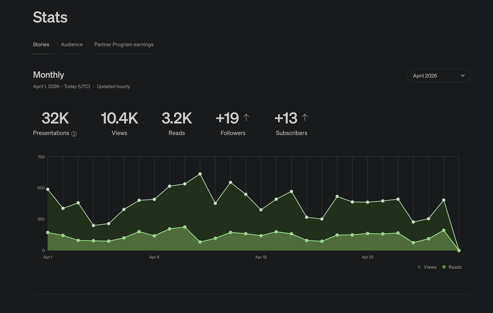
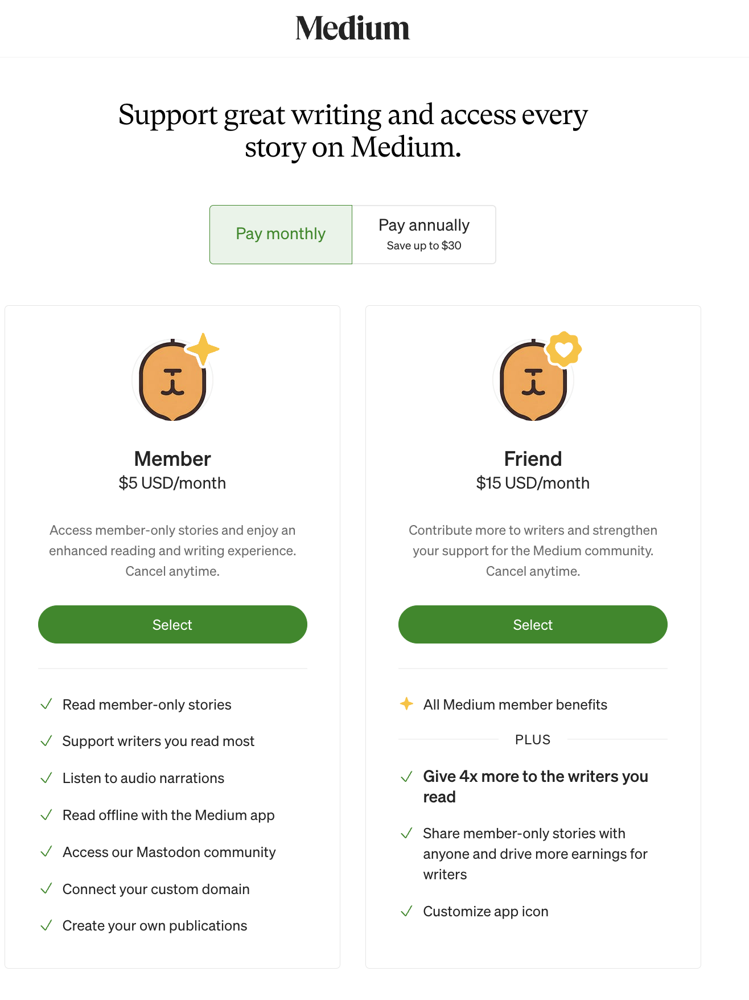
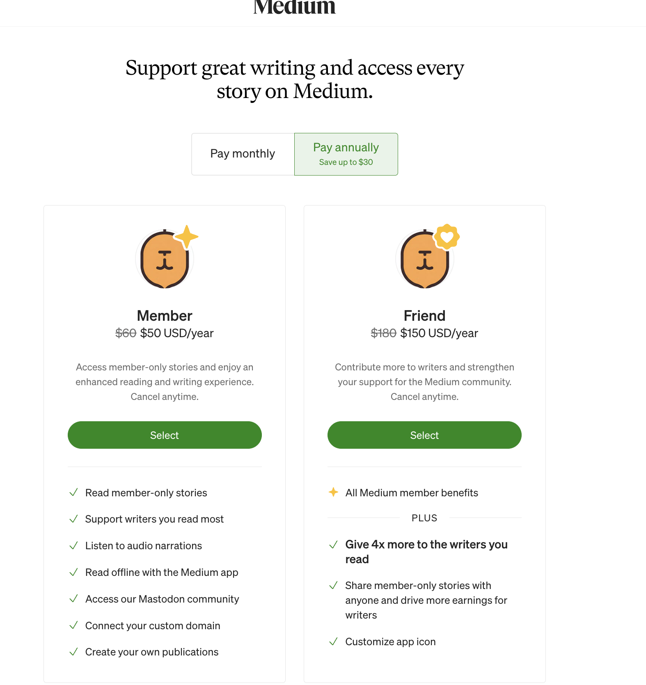
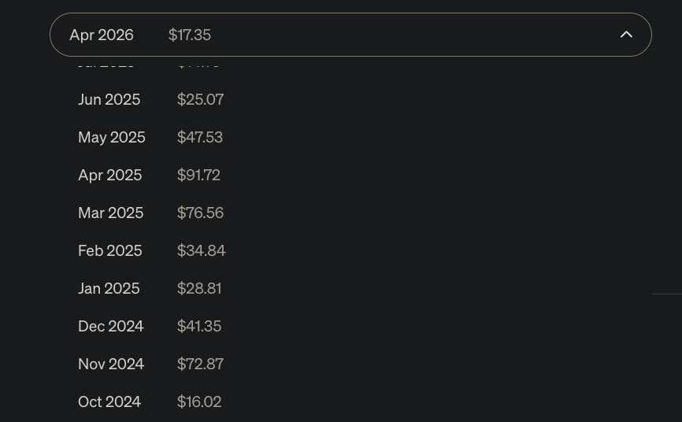

## 1 — The 2026 Medium Economy

### What This Chapter Covers

- Why most "how to earn on Medium" guides you'll find today teach rules that no longer exist
- How Medium's two reader tiers — Member and Friend — determine how much you actually earn per minute of read time
- The February 17, 2026 conversion bonus: a new payout mechanic that rewards stories bringing in new paying readers
- What the real earnings numbers look like from a working writer with 1,171 followers — honest range, not highlight-reel figures

---

### Why 2023+ Guides Are Wrong

If you've searched for advice on earning money from Medium recently, you've probably landed on guides that say something like: "Just publish five stories, get 100 followers, and you're in the Partner Program." That was true once. It is not true anymore.

In August 2023, Medium rebuilt the Medium Partner Program (MPP) from the ground up. Two things changed that made most existing guides obsolete overnight:

**The 100-follower minimum was removed.** You no longer need to reach any follower threshold before applying. A writer with zero followers can apply on day one.

**Writers must be paying Medium members to participate.** This is the rule that almost every outdated guide misses. To earn money through the MPP, you must hold an active paid Medium membership — either $5 per month or $50 per year at the Member tier, or $15 per month or $150 per year at the Friend tier. Free accounts cannot earn from the paywall.

Why does this matter? Because there are hundreds of guides on Gumroad, Amazon Kindle, and YouTube that still teach the pre-August 2023 rules. Readers follow those instructions, apply, get confused when the application asks for a payment method, and assume something has gone wrong. Nothing has gone wrong — the rules simply changed, and the guides did not.

*32K monthly story presentations from a writer with 1,171 followers — distribution is not just for the famous.*

This guide is built entirely on the rules as they exist in 2026. Every step assumes you are starting fresh, that you may have no followers yet, and that you are willing to hold a paid membership as the cost of doing business. That membership fee is the only money you need to spend to begin.

---

### Member vs Friend: The 4× Multiplier

Medium's earnings model does not pay you per view. It pays you based on how long paying readers spend reading your stories. The longer a paying reader stays on your story, the more you earn. This is called read-time-based payouts.

But not all paying readers are worth the same to you as a writer. Medium has two paid reader tiers, and they pass very different amounts of money to writers.

**Member tier:** $5 per month, or $50 per year. This is Medium's standard paid subscription.

**Friend of Medium tier:** $15 per month, or $150 per year. This is the premium subscription. When a Friend of Medium reads your story, approximately four times as much per minute of read time of their subscription dollar passes to you compared to a Member.

*Monthly: $5 Member, $15 Friend.*

*Annual: $50 Member, $150 Friend — saves up to $30.*

Here is a worked example to make this concrete. Suppose you publish a 1,500-word article — roughly a six-minute read. One Member reads it start to finish. One Friend of Medium reads it start to finish. Both spent the same six minutes on your story. But from the Friend's read, you earn approximately four times as much as from the Member's read.

You do not control who subscribes at which tier. What you can control is writing stories that attract and retain engaged readers at any tier. The Friend multiplier is not a strategy — it is a reminder that your earnings are a function of genuine reading time, not clicks or page views. A reader who opens your story and leaves in thirty seconds earns you almost nothing. A reader who reads to the end earns you far more, regardless of their tier.

The practical implication: write complete, focused stories that readers finish. A 900-word story read fully outperforms a 3,000-word story skimmed for thirty seconds.

---

### The Feb 17, 2026 Conversion Bonus

On February 17, 2026, Medium introduced a new payout mechanic that rewards writers whose stories bring in new paying readers.

Here is how it works. When a non-member — someone browsing Medium without a paid subscription — hits your paywalled story (a story is "paywalled" when it is placed behind Medium's subscription gate, meaning non-members can only read the first few hundred words), they see a prompt to subscribe. If that reader subscribes to a paid Medium membership during that same browsing session, you receive a conversion bonus on top of whatever you would have earned from that reader's normal read time.

This is significant because it aligns your earnings with one of Medium's core business goals: growing its paying subscriber base. Before this change, all paywalled stories were treated equally regardless of whether they converted anyone. Now, stories that actively persuade fence-sitters to subscribe earn more.

The full details are documented in Medium's official blog post announcing the change:
https://medium.com/blog/partner-program-update-starting-february-17-were-rewarding-stories-that-bring-in-new-members-3e84d2eb6e68

Medium has not published the exact bonus amount per conversion; it varies by story and is not broken out in the writer dashboard, but it does add a separate line item to the monthly earnings report when conversions occur.

The practical implication for your writing: stories that are genuinely useful to readers who have never paid for Medium — tutorials, clear explainers, answers to specific questions — are more likely to prompt conversions than stories written primarily for existing subscribers. Writing for the uninitiated reader is not just good editorial practice; in 2026, it is also better monetization strategy.

---

### The Boost Program Decline

The Boost Nomination Program still exists in 2026. When a Medium curator "Boosts" a story, that story receives elevated distribution — shown to more readers across the platform. Being Boosted was, through most of 2023 and into early 2024, a meaningful earnings event.

It is now much less so.

The payout bonus attached to a Boosted story has fallen sharply. In 2024, a Boost typically added approximately 30% more earnings on top of a story's organic read-time revenue (based on community reports tracked by Medium writer forums and personal observation). By 2025, that figure had dropped to around 7% by the same measures. In early 2026, following Medium's January 2026 rebalance of its payout algorithm, Boost bonuses fell further. The rebalance shifted weight away from Boost and toward two other signals: base reading time and new-member conversions (the February 17 mechanic described in the previous section).

This does not mean you should write stories that avoid Boost eligibility. A Boosted story still reaches more readers, which means more read time, which means more earnings — just through the standard read-time mechanism rather than through a large bonus multiplier. Being Boosted is still a good outcome.

What it does mean: do not build your income model around the assumption that a handful of Boosted stories will generate significant payouts. The writers who earn consistently on Medium in 2026 are doing so through volume, quality, and conversions — not through Boost lottery wins. This guide will not teach you to optimize for Boost nominations, because that optimization has diminishing returns. It will teach you to build a catalog of stories that earn steadily.

---

### The AI Content Policy in Plain English

Medium has an explicit policy on AI-generated content as of 2026, and it has real consequences for your earnings. Here is what it says in plain terms.

**AI-generated text cannot be paywalled, regardless of whether you disclose it.** This applies to fully AI-written stories and to stories where AI wrote a substantial portion of the prose.

**If you publish AI-generated content without disclosing it,** Medium's systems demote that story to "Network only" distribution. Network only means your existing followers can see the story in their feed, but the story does not appear in topic feeds, search results, or anywhere that new readers would discover it. In practice, this cuts off MPP earnings almost entirely — read time from your existing audience alone is rarely significant enough to generate meaningful payouts.

**If you disclose that a story is AI-generated,** Medium keeps it visible, but it still cannot earn through the paywall. Disclosed AI content can exist on Medium; it simply cannot monetize.

The policy is not a prohibition on using AI tools. It is a prohibition on publishing AI prose as your own writing. The practical distinction:

- Using AI to generate an outline: allowed, no disclosure needed, no earnings impact.
- Using AI to suggest edits to your draft: allowed, no disclosure needed, no earnings impact.
- Using AI to write the sentences and paragraphs: not allowed for paywalled stories.

The writers who try to shortcut this with bulk AI-generated content either see their stories suppressed immediately or earn nothing from paywalled placement. The policy is enforced algorithmically and at the editorial level. Do not build your Medium income strategy around AI-written prose.

Use AI the right way: to help you think through a topic faster, to check your structure, to tighten a paragraph you have already written. Write the prose yourself. This is not just about following rules — stories that read like a human wrote them convert readers and hold attention in ways that AI-smoothed text typically does not.

---

### Real Receipts, Not Hype

Before you invest time building a Medium writing practice, you deserve to see real numbers from a real account — not screenshots of a $10,000 month from a writer with 500,000 followers.

Here are the numbers from my own account. I have been writing on Medium since 2017. As of April 2026, I have 1,171 followers. My monthly earnings over the eighteen months from October 2024 through April 2026 are shown below.

*Real monthly earnings, Oct 2024 → Apr 2026. The honest range is $16–$92.*

The highest single month was $91.72, in April 2025. The lowest was $16.02, in October 2024. The most recent month at time of writing — April 2026 — was $17.35.

What do these numbers mean? A few things worth being clear about.

First, earnings vary from month to month, and individual stories perform unpredictably. A story you think will do well sometimes earns almost nothing. A story you wrote in an hour sometimes earns for months. There is no formula that produces a guaranteed result per story.

Second, the floor here is not zero. Even in a quiet month with no standout stories, the catalog of existing published work continues earning small amounts. Building a catalog is how you build a floor.

Third, the goal of this guide is not $10,000 per month. The realistic, achievable milestone for a writer who is consistent, writes for humans, and understands the 2026 rules is crossing $100 per month within six to twelve months. That is the number this book is designed to help you reach. It is a real number, not a viral outlier.

Writers in any of the 100+ countries where the MPP is available can reach this milestone. The platform does not pay differently based on where you live — your earnings depend on how long paying readers anywhere in the world spend on your stories, not on your geography.

---

### What's Next

Chapter 2 covers the four hard eligibility requirements every writer must meet before earning a single dollar from Medium — including the countries where the MPP is and is not available. Before you write a single word for the paywall, it is worth confirming you qualify. The requirements are straightforward, but there are still exclusions that catch writers by surprise. Chapter 2 will walk through each requirement so you can confirm your status before investing time in the writing work that follows.

