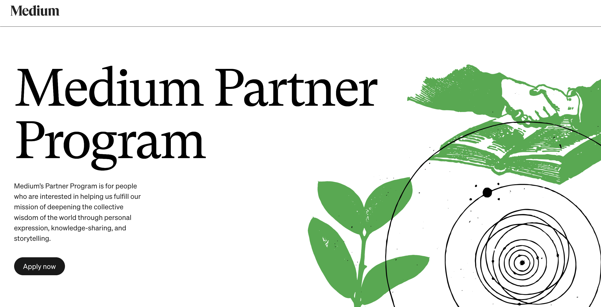
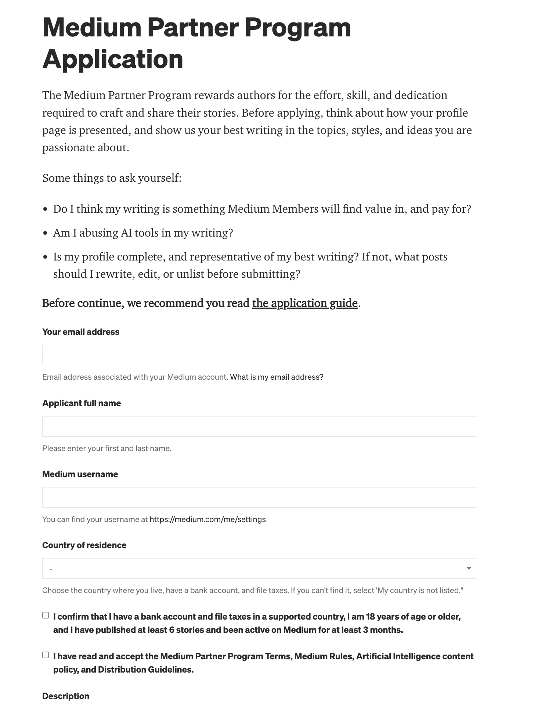

## 2 — Eligibility Without Confusion

### What This Chapter Covers

- The 4 hard requirements that must all be true before you can apply to the Medium Partner Program in 2026
- Which countries are now supported — including the 77 new countries Medium added in August 2024
- The 6 most common rejection reasons and how to avoid every one of them
- A step-by-step walkthrough of the application form, field by field

---

### The 4 Hard Requirements

To join the Medium Partner Program and start earning, four things must be simultaneously true at the time you apply. Missing any one of them results in rejection, and you then have to wait 30 days before trying again.

**1. At least 6 published stories on your profile.**
Drafts and unlisted stories do not count — only publicly visible, live stories. Aim for 8–10 before applying to give reviewers a comfortable sample and reduce borderline calls.

**2. Account active for at least 3 months.**
The clock starts from account creation, not your first published story. If you created your account years ago and are only now publishing, this requirement is already satisfied. If you are brand new to Medium, create your account today — the count begins immediately.

**3. Age 18 or older.**
Self-reported on the application form. Medium reserves the right to verify and remove accounts that provided a false age.

**4. An active paying Medium membership.**
You must hold a paid membership at the moment you apply and keep it active to keep receiving payouts. Both tiers qualify:

- **Member tier:** $5 per month or $50 per year
- **Friend of Medium tier:** $15 per month or $150 per year

You do not need the Friend tier to join the MPP — it affects your earnings rate per read (covered in Chapter 1), not eligibility.

**One requirement that no longer exists: a follower minimum.** Medium removed the 100-follower minimum in August 2023. Any guide still mentioning a follower threshold is teaching rules that have been obsolete for nearly three years. You can apply with zero followers.

---

### Where You Live: 100+ Supported Countries

In August 2024, Medium expanded the MPP to 77 additional countries, bringing the total to more than 100 across six continents. Before that expansion, eligibility was largely limited to English-speaking markets and Western Europe. Writers in Indonesia, Nigeria, the Philippines, and dozens of other countries who were previously excluded can now fully participate.

The underlying infrastructure for payouts is Stripe Express. If your country supports Stripe Express, you can receive MPP earnings. If it does not, you cannot — regardless of your writing quality.

| Continent | Sample countries | Notes |
|-----------|-----------------|-------|
| Asia | India, Indonesia, Philippines, Malaysia, Vietnam, Bangladesh, Pakistan, Thailand, Singapore, Japan | Majority of the August 2024 expansion; all major markets now covered |
| Africa | Nigeria, Kenya, South Africa, Egypt, Ghana, Morocco | Six of the continent's largest economies included |
| Latin America | Brazil, Mexico, Argentina, Colombia, Chile, Peru | Most of the region now supported |
| Europe | Most EU countries, UK, Norway, Switzerland, Iceland | Broadly covered since before the 2024 expansion |
| North America | United States, Canada | Supported since the MPP's original launch |
| Oceania | Australia, New Zealand | Supported since the MPP's original launch |

Because Stripe periodically adds countries, the canonical, always-current list is at **https://stripe.com/global**. If your country is not listed today, check back — the trend since 2023 has been consistent expansion.

---

### The 6 Common Rejection Reasons

Medium does not always tell you exactly why your application was rejected. Understanding the six most common causes lets you audit your own profile before applying, rather than discovering problems after the fact.

**1. Not currently a paying Medium member.**
The most common rejection cause. The application asks for a payment method to verify existing membership — not to charge you. If your membership is expired or you have never subscribed, the application will not go through. Confirm your subscription is active before submitting.

**2. Country not supported by Stripe Express.**
If Stripe Express does not operate in your country, Medium cannot pay you. Check https://stripe.com/global before anything else — it is a prerequisite, not a formality.

**3. "Insufficient unique value."**
This is a vague rejection label that has appeared more frequently since late 2025. In practice it means a human reviewer — or an assisted review process — judged your published stories as derivative: listicles that read like dozens of others, summaries of well-known topics with no original perspective, or content that feels interchangeable with what already exists on the platform. The fix is publishing at least two stories that could not have been written by anyone else — personal experience, specific data you gathered, an analysis grounded in your own professional context.

**4. Flagged AI-generated writing.**
Medium does not accept stories generated entirely by AI. Writing that reads as AI-assisted — uniform sentence rhythm, no first-person specificity, vague transitions — increasingly triggers this flag even on lightly edited drafts. Revise until the writing has a clear human voice with personal detail before applying.

**5. Profile incomplete.**
No profile photo, no bio, and no pinned story sends a signal that the account is not ready for a professional program. Medium reviewers look at your full profile as context for the application. An anonymous-looking profile with minimal configuration gets rejected at a higher rate than one that looks like a real person is running it.

**6. Under 6 stories or under 3 months active.**
This sounds obvious, but writers occasionally miscount. Unlisted stories, drafts, and responses to other articles do not count as published stories on your profile. Count only standalone stories that a visitor can find by scrolling your profile page. The 3-month clock is from account creation, not first publish, so verify your account creation date in your profile settings if you are close to the line.

---

### The 30-Day Cooldown Trap

A rejected applicant must wait 30 days before reapplying. Submitting again before the window closes results in automatic rejection. A preventable rejection costs you an entire month — which is why the checklist at the end of this chapter matters.

Use the 30-day window productively:

**Improve your two weakest stories.** Rewrite them with a sharper opening, a more specific personal angle, and a cleaner conclusion. Do not delete and republish — update the existing story to preserve the original publication date.

**Fill in every profile gap.** Add a profile photo, write a bio, and pin the story you consider your strongest work. These take under an hour and are entirely within your control.

**Verify your membership is active.** Confirm your paid membership is current and will not lapse during the review window. A membership that expires while your application is under review is a preventable rejection.

---

### Step-by-Step Application Walkthrough

The application lives at **medium.com/membership/partner-program**. Do not open it until you have confirmed all four eligibility requirements are satisfied.

*The Medium Partner Program landing page — your starting point at medium.com/membership/partner-program*

Click "Apply now" from the landing page. Medium may show a brief requirements checklist first — review it, confirm each item applies to your account, then proceed to the form.

*The MPP application form — fields walked through below.*

**Email address.** Pre-filled from your Medium account. Payout notifications and Stripe onboarding will arrive here. If it is an old address you no longer check, update your Medium account email before starting.

**Full legal name.** Enter your name exactly as it appears on your government-issued ID — Stripe uses this for identity verification. Nicknames will cause problems at onboarding.

**Medium username.** Your @handle, pre-filled. Confirms which profile is being evaluated.

**Country of residence.** Choose the country where you currently live — this must match the country you use when setting up Stripe Express. Residency determines payout eligibility, not citizenship.

**Confirmation checkboxes.** Two checkboxes: one confirming you are 18 or older, one confirming you agree to the MPP terms. The terms cover earnings calculation, the paying-member requirement, and what happens if your membership lapses — worth a quick read.

**Description textarea.** This field asks you to introduce yourself and your writing. Write 2–3 short paragraphs:
- Paragraph 1: Who you are and what you write about. Be specific. "I'm an Android developer in Lagos writing about mobile UI patterns and building in public" is better than "I write about tech."
- Paragraph 2: What you plan to publish. A consistent niche signals seriousness.
- Paragraph 3: Your goal. "I want to build a sustainable writing income alongside my freelance work" is honest and appropriate. You do not need to claim ambition you do not have.

Submit the form. Medium typically reviews applications within a few business days, though the timeline can stretch to two weeks during busy periods. You will receive a decision by email.

---

### Profile Completeness Checklist Before Applying

Run through this checklist the day before you submit your application. Everything here is within your control and costs nothing to fix.

- [ ] **Profile photo uploaded** — a clear image where your face is visible, with a neutral or simple background. It does not need to be professional, but it should be recognizable as a real person.
- [ ] **Bio filled in** — use the formula from Chapter 3: one sentence on who you are, one sentence on what you write, one optional sentence on your background or credibility. Chapter 3 walks through this in detail.
- [ ] **At least 6 stories published** — verify by opening your public profile page in a private browser window and counting visible stories. Aim for 8–10 to give reviewers a comfortable sample.
- [ ] **One story pinned** — your strongest piece should be pinned to the top of your profile. This is the first thing a reviewer sees. If none of your current stories feel strong enough to pin, that is a signal to revise one before applying.
- [ ] **At least one story published in the last 30 days** — an account that has been silent for months reads as inactive. Publish something in the four weeks before your application, even if it is a shorter piece. It demonstrates the account is a going concern.

Once all five items are checked, your application is ready to submit.

---

*Next: Chapter 3 covers the Medium profile setup in full — bio formula, niche selection, and how to write a pinned story that does the work of attracting the right readers.*

