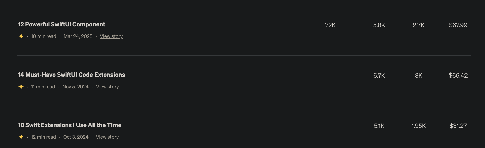

## 4 — The Number+Hook Title Formula

### What This Chapter Covers

- Why "I" is the single most predictive word in viral Medium titles — and how personal-experience framing changes the math entirely
- Which numbers drive the most clicks, and exactly where the ceiling is before a list looks like clickbait
- The odd-versus-even debate, settled by data — and why the author's own even-numbered titles consistently outperformed the rule
- Six hook patterns that work across niches, a concrete exercise to produce a working title in under ten minutes, and a one-line terminal check so you never lose clicks to a truncated headline again

---

### Why "I" Wins

When CoSchedule and independent writers analyzed viral Medium headlines over 2025 and into 2026, one pattern showed up more consistently than any other: the presence of a first-person pronoun. Not a clickbait phrase. Not a power word. Just "I."

[An analysis of 100 viral Medium headlines](https://medium.com/write-a-catalyst/i-analyzed-100-viral-medium-headlines-these-5-patterns-repeated-eba1b71f302f) found that personal-experience listicles dominated the top-performing tier. Titles like "10 Things I Learned After Three Years of Writing on Medium" outperformed structurally similar titles without the "I" by a meaningful margin. The pattern repeated across tech, finance, career, and lifestyle niches.

The reason is straightforward: Medium readers are not looking for encyclopedia entries. They are looking for someone who has been through something and is reporting back. "I" signals that someone actual wrote this from experience, not from a keyword research spreadsheet.

This changes the default framing for every number-based title you write. The formula is not just `[N] [items]`. The formula is `[N] [items] I [verb] [context]` — and it is the "I [verb]" clause that does the real work.

Compare these pairs:

- "10 Python Libraries for Data Science" vs "10 Python Libraries I Use Every Week at Work"
- "7 Habits of Productive People" vs "7 Habits That Changed My Output After I Left My 9-to-5"
- "5 Budgeting Mistakes to Avoid" vs "5 Budgeting Mistakes I Made in My First Year of Freelancing"

In each case the second title carries a specific human being's experience. Readers click on people, not topics.

---

### The Optimal Number Range

Not all numbers are equal. Headline research from [CoSchedule's analysis of headline formulas](https://coschedule.com/headlines/headline-formulas-and-templates) consistently shows that 10 is the strongest single number in list headlines. The numbers 5, 7, and 15 follow closely. Below 15, performance is generally strong. Above 20, the title starts reading as hyperbolic — "47 Things Every Developer Should Know" triggers skepticism more than curiosity.

A few practical observations across the range:

**3–4:** Work for high-confidence, specific claims. "3 Tools I Use to Deploy Faster" signals curation, not padding.

**5 and 7:** Reliable in nearly every niche — short enough to feel curated, high enough to feel comprehensive.

**10:** The strongest single number. It maps cleanly to human memory — complete without excessive. When unsure, start here.

**12 and 14:** Underused by most writers. They work when the number is authentic — when you genuinely found that many things worth discussing, not when you invented items to reach a round count. More on this below.

**15–20:** Viable when the topic is broad enough. "20 Lessons I Learned in 20 Years" works because the number maps to a milestone.

**Above 20:** Avoid. "47 Things Every Developer Should Know" triggers skepticism. Numbers above 20 start compensating for thin content rather than signaling it.

The practical rule: pick a number that matches your actual list. Authentic counting beats round-number discipline.

---

### Odd vs Even: The 20% Rule and When to Break It

The standard advice is to use odd numbers. [OptinMonster's analysis of high-performing headlines](https://optinmonster.com/why-these-21-headlines-went-viral-and-how-you-can-copy-their-success/) found that odd-numbered headlines achieve approximately 20% higher click-through rates than even-numbered equivalents. That data is real, and the likely reason is cognitive: odd numbers feel less manufactured than even ones.

But there are two situations where even numbers consistently outperform the rule.

**When the even number maps to a genuinely exhaustive list.** If you built 12 SwiftUI components over two years and you are writing about all 12 of them, "12 SwiftUI Components" is more credible than "11 SwiftUI Components" or "13 SwiftUI Components." Readers can sense when a number was chosen for optics versus chosen because that is what the author actually built. Authenticity beats the 20% CTR edge.

**When the even number is paired with first-person framing.** "12 Things I Use Daily" does not suffer from the even-number CTR penalty in the same way a generic "12 Things Every Developer Needs" would. The "I use" clause does enough credibility work to make the number almost irrelevant — readers are clicking because a person is speaking, not because the number is psychologically optimal.

The author's own publishing history illustrates this clearly, which is the subject of the next section.

---

### Author Case Study: $67.99 from One SwiftUI Listicle


*Top 3 SwiftUI articles by earnings — note the numbers (12, 14, 10) and the "I use" framing on the third title.*

Three articles, all with even numbers (12, 14, 10), all written between 2023 and 2025, account for a meaningful share of total Medium earnings. Here is what each one looked like and why the title worked.

**"12 Powerful SwiftUI Components" — $67.99, 5,800 views, 2,700 reads, 47% read ratio**

The 12 was not chosen by keyword research. It was chosen because there were exactly 12 components used in production apps — no invented entries to hit a round number. The 47% read ratio confirms it: readers who clicked stayed through to the end at nearly half the click rate, which is strong for a 2,000+ word listicle. "Powerful" is a claim, and claims invite curiosity — readers want to see whether your definition matches theirs.

**"14 Must-Have SwiftUI Code Extensions" — $66.42, 6,700 views, 3,000 reads, 45% read ratio**

Most writers would trim 14 to 12 or round up to 15. The decision to keep it at 14 was simple: there were 14 extensions genuinely worth writing about. "Must-Have" frames the list as curation — someone with real production experience telling you which extensions matter. Similar earnings and read ratio to the first article suggest that in a specific niche, the exact even number matters less than the authenticity behind it.

**"10 Swift Extensions I Use All the Time" — $31.27, 5,100 views, 1,950 reads, 38% read ratio**

This is the "I use" frame in its purest form — the title says explicitly that a specific person uses these things, not that they are important in the abstract. The earnings are lower than the SwiftUI pair, not because the title performed worse, but because the audience for plain Swift articles is smaller on Medium than for SwiftUI. The read ratio at 38% is still solid.

The pattern across all three: even numbers plus first-person framing plus niche specificity. None of these titles used the word "best," "ultimate," "amazing," or any other superlative. They relied entirely on specificity and personal credibility.

The takeaway is not that odd numbers are wrong — the data showing ~20% higher CTR for odd numbers holds in aggregate. The takeaway is that first-person framing combined with authentic counting consistently overrides that baseline. Write the list you actually have. Name it with the number you actually counted.

---

### The 6 Hook Patterns That Actually Work

These six patterns cover nearly every title situation you will encounter. For each one, the formula is followed by a tech-niche example and a non-tech example — because the formula works across subjects.

**1. Usage Hook**

Formula: `[N] [items] I Use [daily / every day / in production]`

This is the pattern that powered the "10 Swift Extensions I Use All the Time" result above. The verb "use" anchors the title in practice rather than theory. It signals: this is not a curated list from the internet, this is what one person actually reaches for.

- Tech: "7 VS Code Extensions I Use Every Day on Client Projects"
- Non-tech: "9 Kitchen Tools I Use More Than My Expensive Stand Mixer"

The specificity qualifier — "on client projects," "more than my expensive stand mixer" — is optional but adds credibility when it fits naturally.

**2. Outcome Hook**

Formula: `[N] [items] That [Saved Me / Changed My / Made Me $Y]`

Outcomes are the second-most powerful hook because they make an implicit promise: read this, get the result. The dollar sign version ($Y) is particularly effective in finance, freelancing, and side-income niches because it converts the vague promise of "improvement" into a specific, verifiable claim.

- Tech: "5 Refactoring Habits That Cut My Bug Rate in Half Last Quarter"
- Non-tech: "6 Freelance Habits That Made Me $3,000 Extra This Year Without New Clients"

Do not invent the outcome. If your savings habit did not actually save you money, do not write that it did. Specificity works only when it is true — readers in any niche eventually call out fabricated numbers.

**3. Contrarian Hook**

Formula: `[N] [items] Most [audience] Get Wrong`

The contrarian frame works because it flatters the reader — it implies that the reader, by clicking, will learn something that most people miss. The key constraint: you need an actual contrarian position, not just a reframing of conventional wisdom with "wrong" appended.

- Tech: "8 Python Best Practices Most Junior Developers Get Wrong"
- Non-tech: "5 Retirement Planning Rules Most People in Their 30s Get Wrong"

The audience identifier — "junior developers," "people in their 30s" — makes the contrarian claim land harder by targeting it.

**4. Regret Hook**

Formula: `[N] [items] I Wish I Knew Before [milestone]`

Regret titles work because they promise lived experience delivered in a format that lets the reader skip the pain. The milestone gives the title a narrative anchor — "before I launched my first app," "before my first remote job," "before I turned 30."

- Tech: "11 Things I Wish I Knew Before Publishing My First iOS App"
- Non-tech: "7 Money Rules I Wish I Knew Before My First Year of Freelancing"

The first-person "I wish" phrasing is load-bearing. "11 Things New iOS Developers Should Know" is weaker because it lacks the narrative of someone who learned through experience.

**5. Secret Hook**

Formula: `[N] Underrated [items]` or `[N] Hidden [items]`

This pattern taps into information asymmetry — the reader suspects there are things they do not know, and the title confirms it. "Underrated" works better than "hidden" for tools and techniques; "hidden" works better for features and settings.

- Tech: "6 Underrated Xcode Features That Save Me 30 Minutes a Week"
- Non-tech: "8 Underrated Budget Apps That Actually Work for People Who Hate Budgeting"

Avoid stacking "underrated" with other hype words. "6 Underrated and Powerful and Must-Know Xcode Features" cancels itself out. Pick one modifier.

**6. Credibility Hook**

Formula: `After [X years/months], Here Are [N] [items]`

The credibility hook works by front-loading tenure — the reader immediately knows they are getting a perspective shaped by experience, not opinion formed from a weekend of research.

- Tech: "After 5 Years of iOS Development, Here Are 10 Tools I Still Use Daily"
- Non-tech: "After 3 Years of Remote Work, Here Are 12 Things I Would Not Give Up"

The number of years or months should be real. "After 5 years" claimed by someone six months into their career gets spotted in the article and destroys trust.

---

### Title Length Rules

The target range is 6 to 12 words and 50 to 70 characters total.

Medium's mobile feed truncates titles longer than approximately 70 characters. A reader scrolling on a phone sees only the first 70 characters — if the most important part of your title is in characters 71 through 90, it is invisible. Given that mobile accounts for more than half of Medium's reading traffic, a title that reads perfectly on desktop but gets cut on mobile is a title that is underperforming everywhere.

The word count target (6–12) is a proxy for clarity. Titles shorter than 6 words often lack the specificity to be compelling; titles longer than 12 words tend to either over-explain or bury the lead. The 6–12 range is where most strong Medium titles land naturally.

Before you commit to a candidate title, paste this Python one-liner into your terminal:

```python
title = "12 SwiftUI Components I Use Daily"
print(f"{len(title.split())} words, {len(title)} chars")
```

Replace the title string with your candidate and run it. If the word count is outside 6–12 or the character count exceeds 70, revise before moving on. This takes about 10 seconds and eliminates one of the most preventable reasons a title underperforms.

A quick example: "12 Underrated SwiftUI Features That Will Make Your Apps Look More Professional in 2026" runs 86 characters — it gets cut mid-sentence on every phone. Trim it to "12 Underrated SwiftUI Features I Wish I Knew Earlier" (53 characters, 9 words) and the full title survives.

---

### The 5-Step Title Exercise

This drill takes less than ten minutes and produces a working title you can commit to. Do it now, before you move to Chapter 5, because the title you write here will shape the structure decisions in the next chapter.

**Step 1: Pick a number.**

Start with 7, 10, or 12 if you do not have a strong preference. These three numbers have the widest margin for error — they are credible without being either too short to be comprehensive or too long to be believable. Once you have more publishing history, you can fine-tune based on what your actual lists look like.

**Step 2: Pick a hook pattern from the six above.**

Pick the one that best fits the piece you are about to write. Writing from direct experience with tools you actually use? Start with the Usage Hook. Specific outcome to report? Outcome Hook. Genuine contrarian position? Contrarian Hook.

**Step 3: Draft 3 candidate titles using your number and hook pattern.**

Write three versions. Do not evaluate while you write — get three candidates on the page first. Vary the specific words, the hook modifier, and the first-person framing between versions. Example for a developer who maintains a mobile app:

- "10 Xcode Shortcuts I Use Every Day to Ship Faster"
- "10 Xcode Features I Use Daily That Most Developers Skip"
- "10 Time-Saving Xcode Tricks I Discovered After Five Years of iOS Work"

**Step 4: Run each through the length check.**

Paste each candidate into the Python one-liner from the previous section. Flag any that exceed 70 characters and revise them before the next step.

**Step 5: Kill 2, commit to 1.**

Eliminate two candidates. The surviving title should have the strongest first-person framing and the most specific hook. "I use every day" beats "most developers should know." "10 Xcode Features I Use Daily That Most Developers Skip" wins over "10 Time-Saving Xcode Tricks I Discovered After Five Years" because the first title names both the author's practice and the reader's gap; the second is richer in backstory but buries the benefit.

Write that title at the top of a new document. It is the first line of your article skeleton — which is what Chapter 5 is about.

---

*The title gets a reader to click. The skeleton is what keeps them reading. Chapter 5 covers the structure that carries a 1,500-word article from the first paragraph to the final line without losing the reader in the middle — and without requiring you to outline before you write.*

